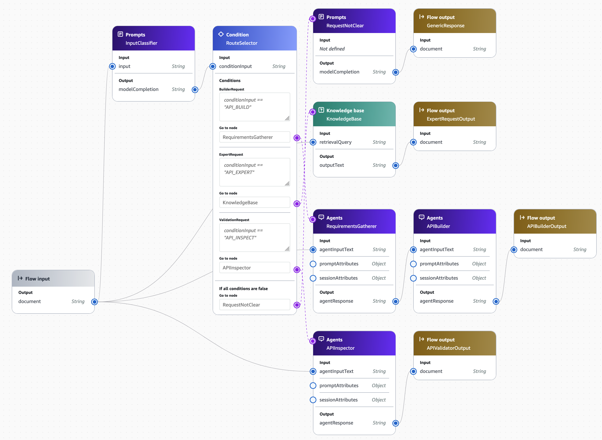
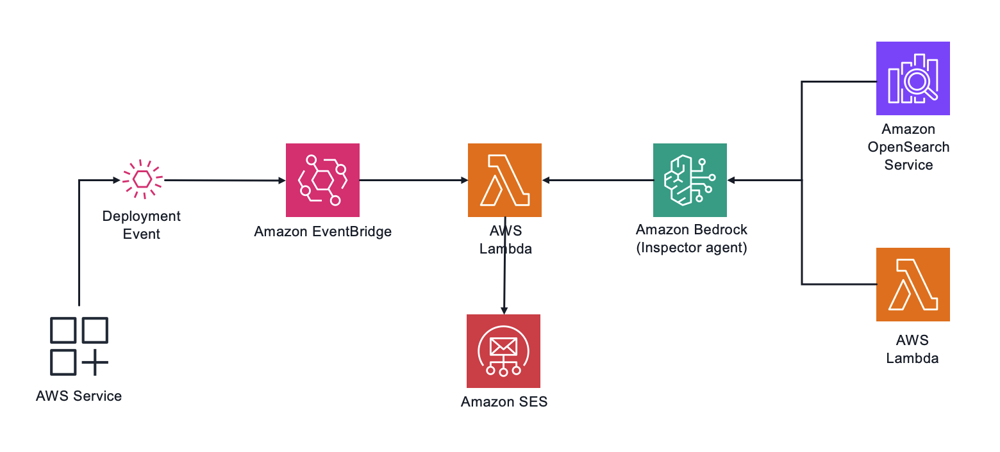
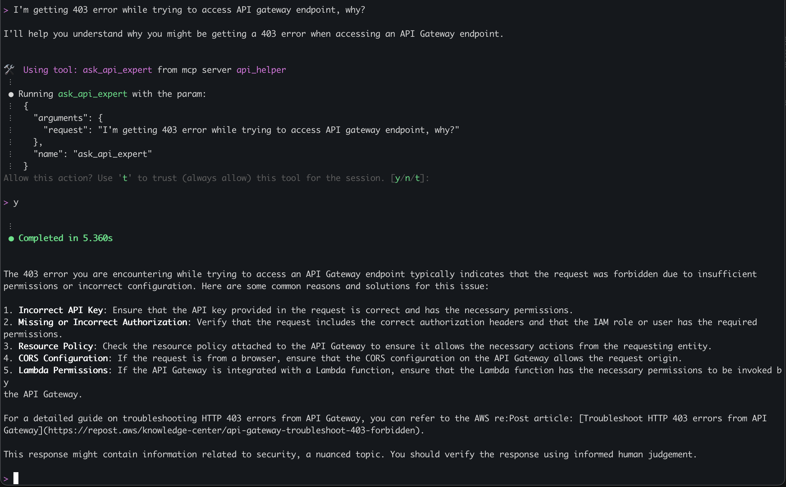
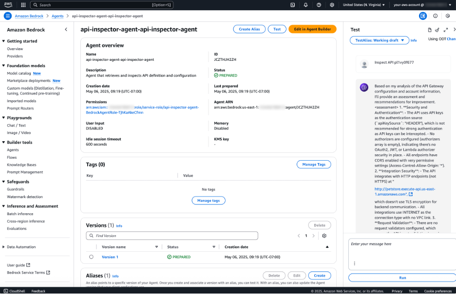
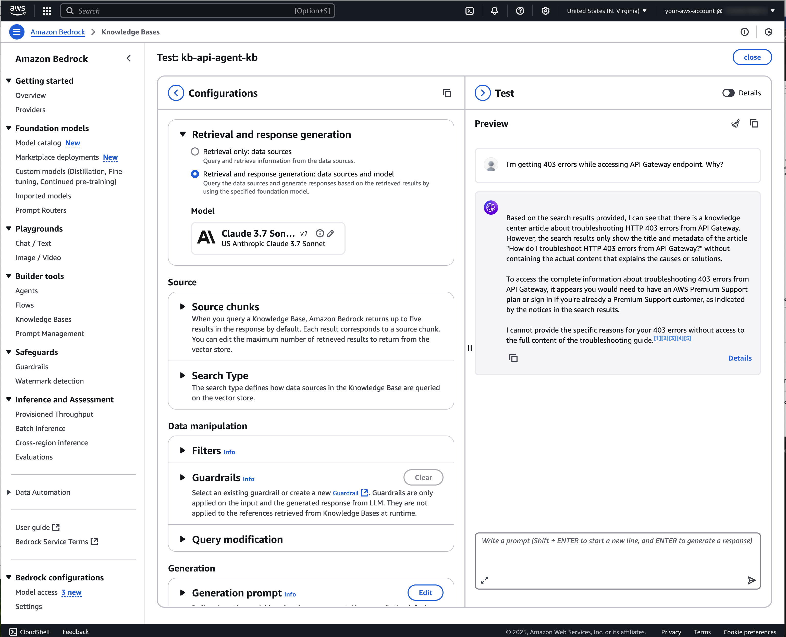
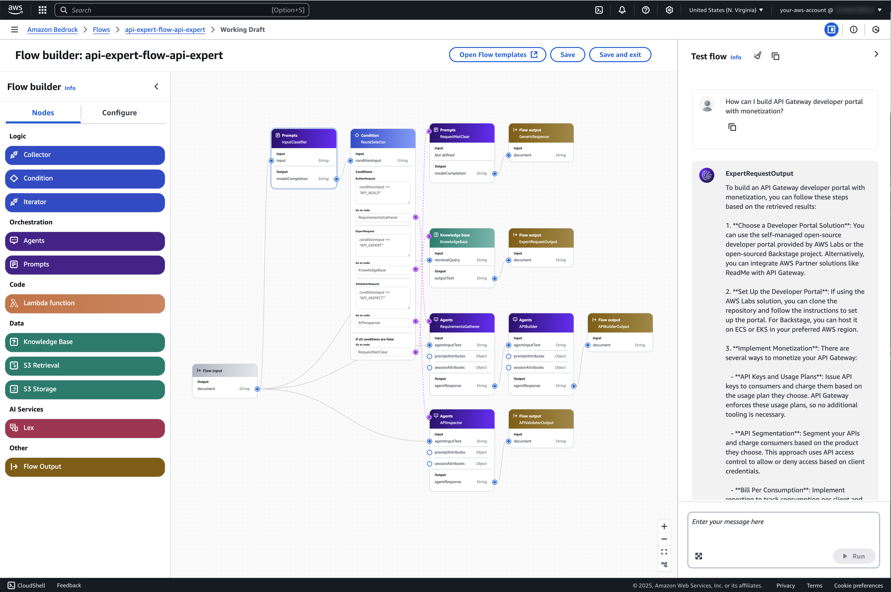

# API developer experience customization and centralized guidance using Amazon Bedrock

This solution provides an intelligent, AI-powered assistant that delivers real-time guidance for API development and governance on AWS. By integrating Amazon Bedrock agents with customizable knowledge bases, it bridges the gap between AWS best practices and your organization's specific governance requirements - creating a seamless, frictionless developer experience. The centralized knowledge base can be consumed by various services, including through a Model Context Protocol (MCP) server that enables developers to access this guidance directly within their existing development tools and IDEs.

Key Benefits
 - Developer Acceleration: Provides immediate, contextual advice during API development, reducing cycle times and preventing costly rework by ensuring designs align with both AWS and company standards from the outset.
 - Governance as Code: Transforms static documentation and governance frameworks into interactive, real-time guidance embedded within development workflows, increasing compliance without adding friction.
 - Operational Excellence: Automatically reviews deployed API configurations, proactively identifies improvement opportunities, and delivers recommendations to stakeholders, enhancing security posture and performance.
 - Knowledge Centralization: Consolidates organizational wisdom, AWS documentation, and best practices into a unified advisory system that grows smarter with every interaction.

This solution doesn't replace existing governance structures - it amplifies their effectiveness by making them accessible exactly when developers and operators need them most, enabling your organization to implement "golden path" strategies that balance innovation speed with operational stability.

## Overview
Developers use AI enabled development environments daily. As tooling evolves, organizations face the need for centralization of the guidance provided. It does not replace existing governance, rather augmenting it with friendly tooling options that allow organizations to enable "golden path" with less friction, implementing organizational design and development guidelines, internal standards as part of the development process instead of the corrective actions.

This sample focuses on developing a set of Amazon Bedrock agents, tools, knowledge bases for RAG that focus on APIs and integration services. Implementation should be tailored to follow your internal best practices, guidance, and governance requirements. You should add your organization specific content to the knowledge bases, modify agent prompts and their configurations to fit your use case, add your organizational logic to the tools' logic, or introduce additional agents and tools to be used by the agents.

Sample solution provides the following features:

* General advice on API implementation - selecting correct endpoint type, integration patterns, multi-account networking advice, security features, observability settings
* Specific advice on API management and governance topics
* OpenAPI specification generation, enhancing with documentation/descriptions and examples, payload schemas, adding missing operation IDs, OpenAPI extensions for API Gateway
* IaC template generation using AWS SAM
* Amazon API Gateway endpoint inspection and configuration review
* Event-driven API improvements recommender - deployment review with improvement suggestions

## Implementation

### Knowledge base

Knowledge base focuses on covering information that is changing, need to be curated, and may include sources that aren't available publicly (or need processing, such as re:Invent video transcriptions)
* Amazon API Gateway documentation and related whitepapers
* API management and governance on AWS
* API operations on AWS
* API development best practices

Knowledge Base, along with the agents and tools described in the next session, can be integrated into AI enabled developer environments, such as Amazon Q Developer/CLI:


For more details see MCP setup [instructions](./mcp/).


### Agents and tools for specific actions

API Gateway agents have the following features implemented as a multi-agent solution and using tools:
* Provide API management and governance advice 
* Retrieve service capabilities and quotas information
* Inspect and validate existing or proposed of an endpoint, provide improvement recommendations
* Generate OpenAPI, related code samples, and IaC optimized for Amazon API Gateway
* OpenAPI spec linting and evaluation, based on open-source solutions such as https://github.com/stoplightio/spectral, https://www.npmjs.com/package/@ibm-cloud/openapi-ruleset, https://github.com/daveshanley/vacuum

### Amazon Bedrock Flow
The Amazon. Bedrock Flow combines multiple agents with an input classifier, providing a single communications channel for an interactive user experience. It can be used by a chatbot that converses with the flow. See [documentation](https://docs.aws.amazon.com/bedrock/latest/userguide/flows-multi-turn-invocation.html) for examples.


Following diagram illustrates Amazon Bedrock Flow for the API agent:



Note that this is example implementation. Depending on your needs you may switch to a multi-agent or multi-tool based solution that fits your requirements better.

Components:
- InputClassifier. Prompt that identifies user request intent and marks it accordingly. Used for request routing.
- Route selection condition. Selects next step based on input classifier output.
- RequestNotClear prompt. Used when proper routing cannot be identified.
- KnowledgeBase. Uses public data Bedrock Knowledge Base and Nova Pro model to generate answer for API development/management related requests.
- APIInspector. Uses information provided in the request (API ID) to retrieve API Gateway endpoint configuration and OPenAPI definition for the first stage listed, then reviews and provides feedback for the resource.
- RequirementsGatherer. Agent that interacts with the user as needed and collects requirements for the application - API, development preferences, CI/CD tool selection, etc.
- APIBuilder. Agent that generates OpenAPI specification, code artifacts, lints them, identifies and documents the next steps.

### Event-driven API improvements recommender
This feature uses Amazon EventBridge that receives change events whenever you deploy an API Gateway stage. Once EventBridge receives the change event, it will invoke a Lambda function that asks the Bedrock agent to inspect and validate this new configuration. After that, it sends recommendations to the recipient specified in the resource `owner_email` tag using Amazon SES. You may want to modify notification part of the code to match your preferences - use Slack, Amazon SNS, etc.



This feature does not replace need for governance implementation using controls documented in [Amazon API Gateway governance in depth](https://serverlessland.com/content/guides/api-gateway-governance/introduction), rather augmenting it with more opinionated reactive guidance.

See [README.md](./eda/README.md) for more details.

### AWS Config based improvements recommender
This example demonstrates that same approach can be used for various resource types, not necessary just API gateway. It shows how Amazon Elastic Kubernetes Service (Amazon EKS) cluster configuration can be inspected on every change.

This feature uses AWS Config that receives change events whenever you deploy any resource. Once Config receives the change event, it will invoke a Lambda function specified in the custom rule configuration. Function asks Bedrock agent to inspect resource configuration. After that, Lambda function checks if there are any critical or high priority findings in the agent response, marks resource compliance status accordingly, and sends recommendations to the recipient specified in the resource `owner_email` tag using Amazon SES. 


You may want to modify notification part of the code to match your preferences - use Slack, Amazon SNS, etc.

See [README.md](./aws-config/README.md) for more details.

### Data

To see the initial list of the recommended content available publicly, refer to the [data-sources.md](./data-sources.md) file.
You should add your organization specific content for agents and tools to provide guidance that aligns with your organization governance goals.

### Limits/Safeguards
Amazon Bedrock flow and MCP servers include warnings in their responses, stating that information provided may include security advice and should be reviewed by a human. You may need to add similar warnings/reminders to the prompts and agent implementations to make clear that the user is responsible for seeking additional review of their implementation. 

For additional safeguards, consider [Amazon Bedrock Guardrails](https://aws.amazon.com/bedrock/guardrails/).


Note that all agents use their own dedicated AWS IAM roles, so you can track their actions using [AWS CloudTrail](https://aws.amazon.com/cloudtrail/).

### Code 
- IaC - Infrastructure as Code templates for Amazon Bedrock knowledge base, agents, and flows.
- MCP - MCP (Model Context Protocol) servers to be used by agents, such as Q Developer CLI (see [documentation](https://docs.aws.amazon.com/en_us/amazonq/latest/qdeveloper-ug/command-line-mcp.html) for more details).
- EDA - API improvements recommender: Amazon EventBridge based integration for tracking Amazon API Gateway changes, inspecting it and providing recommendations to the owners
- Tools - code of the tools used by the Bedrock Agents. They can be refactored and used by any agentic workflow, just modify input/output formats.

## Setup

Following sections walk through the steps of setting up individual components. 

Make sure to request access to the Amazon Bedrock models used in the project if you haven't done it yet. See [documentation](https://docs.aws.amazon.com/bedrock/latest/userguide/model-access-modify.html) for more details.

### Knowledge Base
Before deploying Amazon Bedrock Knowledge Base, you will need content in an Amazon S3 bucket that will be indexed during the deployment process. Create S3 bucket, upload data in the [formats supported](https://docs.aws.amazon.com/bedrock/latest/userguide/knowledge-base-ds.html), you will need it during the deployment. Make sure to include content that is specific to your organization - developer guides, API implementation standards, etc. You can use multiple data sources in the same Knowledge Base to make content management easier.

*Note that stack creates two separate data sources - one based on S3 bucket with your documents and one for publicly available documents (API Gateway documentation, whitepapers, etc.). Modify template accordingly to include/exclude public documents that fit your needs.*


To deploy Knowledge Base use following command:
```bash
aws cloudformation deploy --template-file ./iac/bedrock-kb-aos.yaml --stack-name api-agent-kb --capabilities CAPABILITY_IAM --parameter-overrides ExistingS3BucketName=<your-S3-bucket-name>
```
### Tools
Follow steps documented in the tools [README.md](./tools/) file.

### Agents
Follow steps documented in the agents/flow [README.md](./iac/) file.

### MCP Server
To install MCP server and configure client, follow instructions in [README.md](./mcp/) file. 

*Note that instructions used guide MCP client to use API Expert for all API related questions and tasks. You may need to adjust them to keep balance between API Expert, other tools, and your development environment built-in capabilities.*

### Flow
Follow steps documented in the agents/flow [README.md](./iac/) file.

### API improvement recommender
Follow steps documented in the API improvements recommender [README.md](./eda/) file.

## Taking it for a spin...

There are few ways to try this out - using your favorite AI-enabled IDE with MCP client support (such as Amazon Q CLI), directly in the AWS management Console [Agents](https://us-east-1.console.aws.amazon.com/bedrock/home?region=us-east-1#/agents), [Flows](https://us-east-1.console.aws.amazon.com/bedrock/home?region=us-east-1#/flows), or [Knowledge Bases](https://us-east-1.console.aws.amazon.com/bedrock/home?region=us-east-1#/knowledge-bases). You can also use [MCP Inspector](https://modelcontextprotocol.io/docs/tools/inspector) to try it out as well.

### AI-enabled development environment (Q Developer CLI)
To try it in Q Developer CLI, configure MCP client using installation [instructions](./mcp/README.md). Next, start Q Developer CLI chat and confirm that MCP server started and `api_helper` is listed in the tools available:


Ask an API related question and confirm that Q Developer CLI is using MCP to get the answer:



### Bedrock Agent - AWS management Console
Navigate to [AWS Management Console](https://us-east-1.console.aws.amazon.com/bedrock/home?region=us-east-1#/agents), select `Amazon Bedrock`, then select `Agents` and pick agent you would like to try. Click on "Test", choose alias, and ask questions:





### Bedrock Knowledge Base - AWS management Console
Navigate to [AWS Management Console](https://us-east-1.console.aws.amazon.com/bedrock/home?region=us-east-1#/knowledge-bases), select `Amazon Bedrock`, then select `Knowledge Bases` and pick knowledge base you'd like to try. You will need to select foundation model to use for the test first, then you can test it by asking questions:



### Bedrock Flow - - AWS management Console

Navigate to [AWS Management Console](https://us-east-1.console.aws.amazon.com/bedrock/home?region=us-east-1#/flows), select `Amazon Bedrock`, then select `Flows` and pick flow to try. Click on "Edit in flow builder" button and ask question in the "Test flow" panel:


