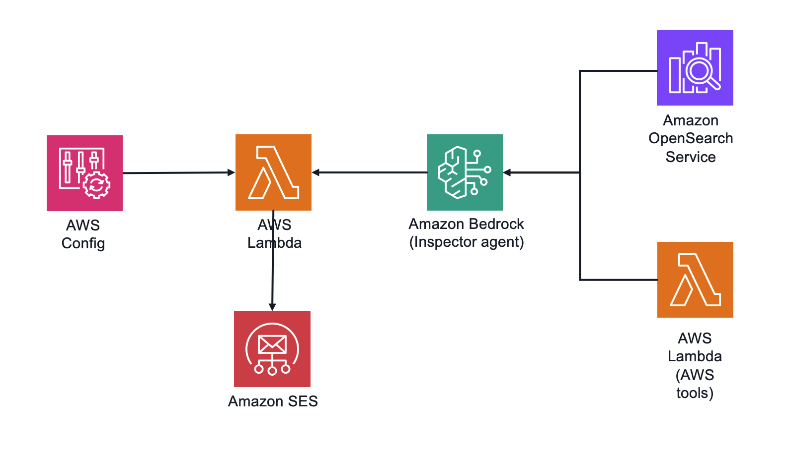

# API Gateway Inspector - AWS Config Driven Workflow

This project implements an automated Amazon API Gateway inspection system using AWS Config, Amazon Bedrock Agent, and AWS Lambda. The system automatically analyzes API Gateway configurations and provides improvement recommendations.

This sample supports both REST APIs (AWS::ApiGateway::RestApi) and HTTP APIs (AWS::ApiGatewayV2::Api) as resources to be monitored for configuration changes.

The sample can be extended by adding Amazon Bedrock Agent integration with a custom knowledge base. This way internal best practices and guidelines can be incorporated into configuration assessment process.

## Architecture Overview



The solution consists of:

1. **AWS Config Driven Lambda Function**: Triggered by AWS Config rules when API Gateway configuration changes
2. **Amazon Bedrock Agent Integration**: Agent uses tools to analyze API Gateway configuration and provides recommendations if necessary
3. **API Gateway Configuration Retrieval Tool**: Lambda function that retrieves detailed API Gateway configuration
4. **Serverless Architecture**: Deployed using AWS SAM (Serverless Application Model)

## How It Works

### AWS Config Driven Workflow

1. AWS Config continuously monitors API Gateway configurations for changes
2. When a configuration change is detected, AWS Config triggers evaluation using custom rule implemented as a Lambda function
3. The Lambda function extracts the API ID from the AWS Config rule evaluation
4. The function invokes an Amazon Bedrock Agent with the API ID
5. The Bedrock Agent retrieves and analyzes the API configuration, then returns improvement recommendations
6. Recommendations are sent to the API owner using Amazon SES
7. AWS Config compliance status is determined by the presence of any recommendations (NON_COMPLIANT if any recommendations exist)
8. Compliance status returned to AWS Config

## Prerequisites

- AWS CLI installed and configured
- AWS SAM CLI installed
- Python 3.13
- AWS Config enabled in your account
- An existing Amazon Bedrock Agent deployment with the API Inspector agent (referenced in the template parameters, see [IaC deployment instructions](../iac/README.md))
- An existing API Gateway Configuration Retrieval tool (Lambda function) deployed (see [tools deployment instructions](../tools/README.md))
- Amazon SES with verified address or domain

## Setup Instructions

### 1. Use the Existing API Inspector Agent

This component reuses the existing API Inspector Agent in Amazon Bedrock. Make sure the API Inspector Agent is already deployed using the template in `iac/api-inspector-agent.yaml`. Note that the API Inspector Agent uses the API Configuration Retriever tool.

Note the stack name of the API Inspector Agent as it will be needed for the next deployment step.

### 2. Build and Deploy

```bash
# Build the application
sam build

# Deploy the application with interactive parameter configuration
sam deploy --guided
```

During the guided deployment, you'll be prompted to provide the following parameters:

- `ApiInspectorAgentStackName`: Name of the stack that exports the API Inspector Agent ID and Alias ID
- `AwsRegionForModelAccess`: AWS region where the API Inspector agent was deployed
- `SesEmailForNotifications`: e-mail "From" address to be used in SES sending recommendation to the owner
- `ApiGatewayConfigRuleName`: Name for the AWS Config rule that will trigger the workflow
