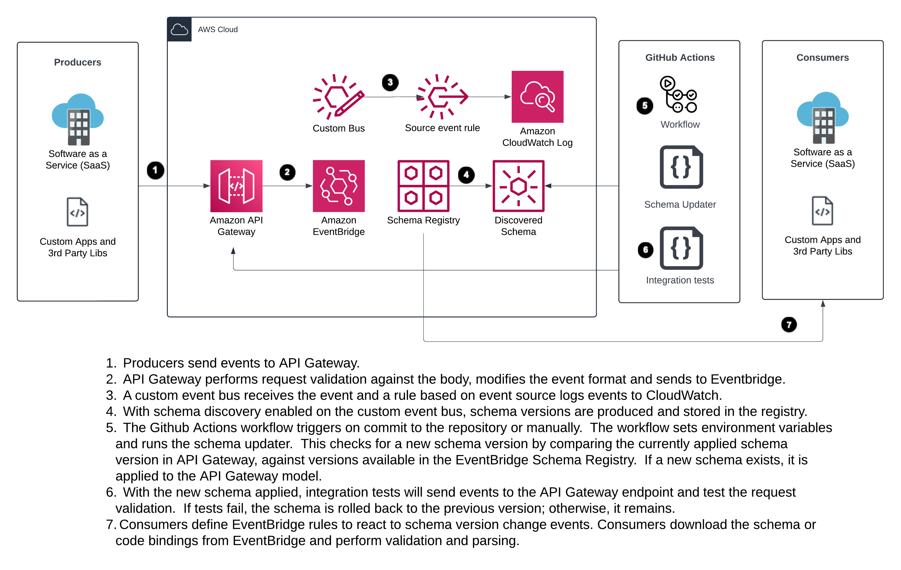
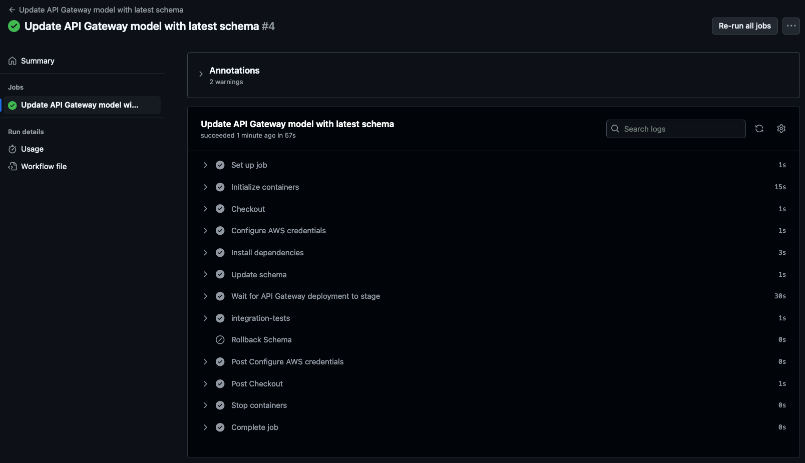
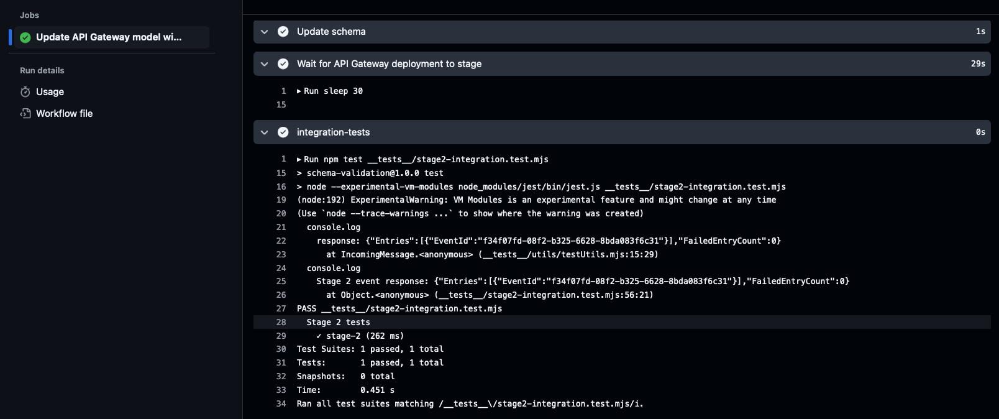
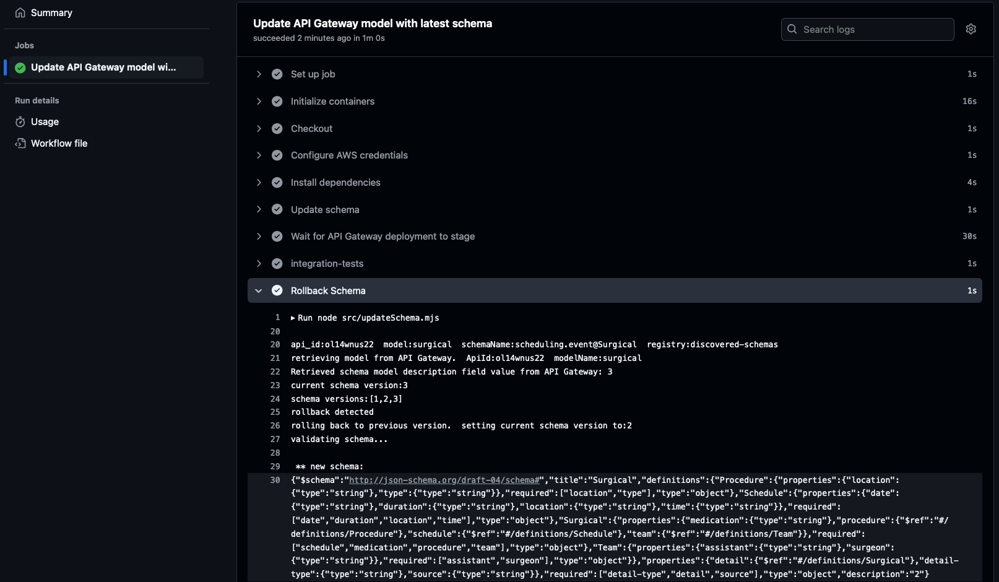

# Automating Event Validation Through Schema Discovery - CI CD Driven Solution

> [!NOTE]  
> For background information on event validation see the [parent directory](../README.md).  This solution shares the same CloudFormation deployment as the Lambda driven solution, but has additional deployment configuration and testing steps covered in this README. 

This CI CD driven solution to automating schema validation through API Gateway provides more control over the schema update process.  In contrast to the Lambda driven solution, the Lambda function does not apply the new schema directly to an API Gateway model.  Instead, it uses a CI CD pipeline to retrieve new schemas from the EventBridge Registry, applies them to API Gateway and runs integration tests.  If tests fail, the newly applied schema will be rolled back to a previous version.  This allows for additional testing and checks before schemas are promoted and enforced for requests.  

This implementation uses a GitHub Actions workflow, detailed below.  The approach can be extended to your preferred CI CD platform.    


<p align="center"> Figure 1: Architecture using GitHub Actions workflow to update API Gateway model with latest schema</p>


## GitHub Actions Pipeline 
[GitHub Actions](https://docs.github.com/en/actions/about-github-actions/understanding-github-actions) is a CI CD platform that allows you to automate your build, test, and deployment pipeline.  You will use GitHub Actions to demonstrate how to automatically update and rollback event schemas from Amazon EventBridge.  This solution builds on the [Lambda Driven Schema Updater](https://github.com/aws-samples/serverless-samples/tree/main/apigw-eventbridge-schema-validation#lambda-driven-schema-updater), using a GitHub Actions workflow to check for new schema versions, update the API Gateway model, run integration tests and rollback the schema if tests are unsuccessful.  

You can find the YAML definition for the pipeline at .github/workflows/surgical-event-pipeline.yml.  This workflow is configured to run on Ubuntu Linux with a supported version of Node.js to run the schema update logic.  Environment variables are required to run effectively and are covered in more detail in the next section.  The integration test step runs a specific test file, allowing you to configure one test per workflow execution to test different event stages.  Each integration test is labeled according to the [event stage](../README.md#stages-of-event-evolution) (i.e. stage1-integration.test.mjs) and stored under the \_\_tests__ directory.  If an integration test fails, the current schema applied to API Gateway will be rolled back to the previous version.  If tests pass, the newly applied schema version will remain.    


<!-- *********************************** TODO: Add visual here of the workflow 
***********************************************************************************--> 

## Deployment

### Pre-Requisites

* [Create an AWS account](https://portal.aws.amazon.com/gp/aws/developer/registration/index.html) if you do not already have one and log in. The IAM user that you use must have sufficient permissions to make necessary AWS service calls and manage AWS resources.
* [AWS CLI](https://docs.aws.amazon.com/cli/latest/userguide/install-cliv2.html) installed and configured
* [Git Installed](https://git-scm.com/book/en/v2/Getting-Started-Installing-Git)
* [AWS Serverless Application Model](https://docs.aws.amazon.com/serverless-application-model/latest/developerguide/serverless-sam-cli-install.html) (AWS SAM) installed
* [NPM](https://docs.npmjs.com/downloading-and-installing-node-js-and-npm) installed

> [!NOTE]
> Important: this application uses various AWS services and there are costs associated with these services after the Free Tier usage - please see the [AWS Pricing page](https://aws.amazon.com/pricing/) for details. You are responsible for any AWS costs incurred. No warranty is implied in this example.

> [!NOTE]
For this solution, you'll need to [fork the repository](https://docs.github.com/en/pull-requests/collaborating-with-pull-requests/working-with-forks/fork-a-repo) to run the GitHub Actions workflow within your GitHub account.  If you're new to GitHub Actions, you may want to review their [documentation](https://docs.github.com/en/actions/about-github-actions/understanding-github-actions) before proceeding. 

1. [Fork the repository](https://docs.github.com/en/pull-requests/collaborating-with-pull-requests/working-with-forks/fork-a-repo)
2. Create a new directory, navigate to that directory in a terminal and clone the GitHub repository that you forked previously:
``` 
git clone https://github.com/<your forked repo path>
```
3. From the command line, change to the pattern directory:
```
cd apigw-eventbridge-schema-validation/cicd-driven-solution
```
4. Copy the .github/ directory to the root of the repository.  GitHub Actions requires workflow files be present in the .github/workflows/ directory at the root of the repository.

```
cp -r .github ../../
```

5. Navigate to the parent directory

```
cd ..
```

6. Deploy the solution as specified in the [parent README deployment section](../README.md#deployment).  Start at step 3 since you have already forked and cloned the repo.  Return back here to the next step after successful deployment.


The GitHub Action workflow uses the ["Configure AWS Credentials V2"](https://github.com/marketplace/actions/configure-aws-credentials-v2-action-for-github-actions#credentials) action.  This uses an AWS access key ID and secret access key stored as secrets.  This sample solution uses [repository level secrets](https://docs.github.com/en/actions/security-for-github-actions/security-guides/using-secrets-in-github-actions#creating-secrets-for-a-repository); however, you can configure them at the [environment or organization level](https://docs.github.com/en/actions/security-for-github-actions/security-guides/using-secrets-in-github-actions#about-secrets).  

> [!NOTE]  
> GitHub Actions requires AWS credentials with appropriate permissions to perform actions within your AWS environment.  This sample should only be used in non-production environments.

For this sample, you'll need a user with permissions to administer API Gateway to update the model and deploy changes, and EventBridge read only access to list and download schemas.

7. [Create the user in IAM](https://docs.aws.amazon.com/IAM/latest/UserGuide/id_users_create.html) and add required permissions.  If you don't have access to perform this operation, you may need to work with your AWS engineering team.  Replace \<user name\> with a descriptive user name of your choice, such as github-actions-schema-validation.  

```
aws iam create-user --user-name <user name>
aws iam attach-user-policy --user-name <user name> --policy-arn arn:aws:iam::aws:policy/AmazonAPIGatewayAdministrator
aws iam attach-user-policy --user-name <user name> --policy-arn arn:aws:iam::aws:policy/AmazonEventBridgeReadOnlyAccess
```
You can verify permissions by running: 

```
aws iam list-attached-user-policies --user-name <user name>
```

Example output: 
```
    "AttachedPolicies": [
        {
            "PolicyName": "AmazonAPIGatewayAdministrator",
            "PolicyArn": "arn:aws:iam::aws:policy/AmazonAPIGatewayAdministrator"
        },
        {
            "PolicyName": "AmazonEventBridgeReadOnlyAccess",
            "PolicyArn": "arn:aws:iam::aws:policy/AmazonEventBridgeReadOnlyAccess"
        }
```


8. Generate the access key id and secret access key.  Note the output, you'll need it for the next step. 

```
aws iam create-access-key --user-name <user name>
```

9. [Create two repository secrets](https://docs.github.com/en/actions/security-for-github-actions/security-guides/using-secrets-in-github-actions#creating-secrets-for-a-repository), AWS_ACCESS_KEY_ID and AWS_SECRET_ACCESS_KEY, with the values obtained from the previous command.

10. In the root directory of the project, open the .github/workflows/surgical-event-pipeline.yml file that you copied in step 4.  Update the environment variables based on your project deployment.  You only need to update the API_ID and AWS_REGION if you left the default settings during deployment.  If you need to view your deployment information again, it can be found in the CloudFormation output tab for your deployment.  

11. Stage and commit the workflow changes to your forked repository.  Ensure the .github/workflows/surgical-event-pipeline.yml at the root of the repository was modified and pushed.   

## Testing

> [!NOTE]  
> GitHub's free tier is sufficient for running the tests in this solution; however, you are responsible for any costs associated within your account.  Please review [GitHub Actions Billing and Payments](https://docs.github.com/en/billing/managing-billing-for-your-products/managing-billing-for-github-actions/about-billing-for-github-actions) for details on GitHub Actions pricing.

This first test will emulate the first stage of the [event evolution](https://github.com/aws-samples/serverless-samples/tree/main/apigw-eventbridge-schema-validation#stages-of-event-evolution).  There is no validation set, so the first event will pass through API Gateway to EventBridge and produce a new schema version.   

Run this command multiple times to send events to the custom event bus. Replace API URL with your API endpoint. 

```
curl --location --request POST '<YOUR API URL>' \
--header 'Content-Type: application/json' \
--data-raw '{
  "detail-type": "surgical",
  "source": "scheduling.event",
  "detail": {
      "schedule": {
        "date": "5/15/2024",
        "time": "10:00 AM",
        "location": "Building 6"
      },
      "team": {
          "surgeon": "Jane Someone",
          "assistant": "John Person"
      }
  }
}'
```
You can validate this event was processed by the Event Bus by viewing the Cloudwatch scheduling-events-source-catch-all log group for events.  The SAM template contains a catch-all rule for any source match.

Schema generation can take up to 5 minutes.  You can view status of discovered schemas by running the following AWS CLI command.  If you receive an error stating it doesn't exist, wait and try again.
```
aws schemas list-schema-versions --schema-name scheduling.event@Surgical --registry-name discovered-schemas
```

Here's an example output, if successful:
```
{
    "SchemaVersions": [
        {
            "SchemaArn": "arn:aws:schemas:us-west-2:<account id>:schema/discovered-schemas/scheduling.event@Surgical",
            "SchemaName": "scheduling.event@Surgical",
            "SchemaVersion": "1",
            "Type": "OpenApi3"
        }
    ]
}
```

Once the first schema version is created in the EventBridge Schema Registry, you can run the GitHub Actions workflow.  Before doing so, make sure the TEST_FILE_PREFIX environment variable is set to "stage1" in the GitHub Actions YAML workflow file.
```  
...
TEST_FILE_PREFIX: "stage1"
...
```

The GitHub Actions workflow can be initiated by either committing a change to the repository main branch or manually through the GitHub UI or CLI by following this [guide](https://docs.github.com/en/actions/managing-workflow-runs-and-deployments/managing-workflow-runs/manually-running-a-workflow).  To enable the workflow to run on commit, remove the comments for the 2 lines referenced toward the top of the workflow file.  Run the workflow.  This will download the latest schema version, apply it to the API Gateway model and test sending an event to API Gateway and through to EventBridge.
 
An example of the GitHub Actions web interface for a manual workflow run: 

<p align="center"> Figure 2: Manual workflow run </p>

Example output of a successful workflow run: 

<p align="center"> Figure 3: Successful workflow run for stage 1    </p>

To test the second event stage, run the following command to send another event to the custom event bus. 

```
curl --location --request POST '<YOUR API URL>' \
--header 'Content-Type: application/json' \
--data-raw '{
  "detail-type": "surgical",
  "source": "scheduling.event",
  "detail": {
        "schedule": {
          "date": "5/15/2024",
          "time": "10:00 AM",
          "location": "Building 6",
          "duration": "120 mins"
        },
        "medication": "Oxycodone 5 mg every 4 hours.",
        "team": {
          "surgeon": "Jane Someone",
          "assistant": "John Person"
        },
        "procedure": {
          "type": "Anterior Cruciate Ligament",
          "location": "left knee"
        }
  }
}'
```
EventBridge will generate a new schema version, which could take several minutes to complete.  Request validation on API Gateway will not be set until after the new schema version is available and the GitHub Actions workflow is successfully run again.  You can run the same AWS CLI command from the first test to view schema versions.  You should see a second schema version created.  

Run the following command again and wait until a second schema version exists.
```
aws schemas list-schema-versions --schema-name scheduling.event@Surgical --registry-name discovered-schemas
```

Here's an example output with version 2 now available: 
```
{
    "SchemaVersions": [
        {
            "SchemaArn": "arn:aws:schemas:us-west-2:<account id>:schema/discovered-schemas/scheduling.event@Surgical",
            "SchemaName": "scheduling.event@Surgical",
            "SchemaVersion": "2",
            "Type": "OpenApi3"
        },
        {
            "SchemaArn": "arn:aws:schemas:us-west-2:<account id>:schema/discovered-schemas/scheduling.event@Surgical",
            "SchemaName": "scheduling.event@Surgical",
            "SchemaVersion": "1",
            "Type": "OpenApi3"
        }
    ]
}

```

Next, update the GitHub Actions workflow file to point to the second integration test:

```  
...
TEST_FILE_PREFIX: "stage2"
...
```

Save the workflow file, push changes to the repository and start another workflow execution.  If you did not enable automatic workflow execution on push to you repository, run the workflow manually again.  It will download the latest schema, apply it to API Gateway and verify by running the stage2 integration test.  If the tests pass, the new schema was applied successfully. 


<p align="center"> Figure 4: Successful integration test run for stage 2   </p>

You can test the request validation by sending in an event that does not have all the required fields.  

```
curl --location --request POST '<YOUR API URL>' \
--header 'Content-Type: application/json' \
--data-raw '{
  "detail-type": "surgical",
  "source": "scheduling.event",
  "detail": {
      "surgery": {
        "schedule": {
          "date": "5/15/2024",
          "time": "10:00 AM",
          "location": "Building 6",
          "duration": "120 mins"
        }
      }
  }
}'
```
Some of the required objects and properties have been removed, which will be caught by the request validator and rejected.  Note: if your event is passed through successfully, you may need to wait for the new schema version to be created and processed.

```
{ "message": "[object has missing required properties ([\"medication\",\"procedure\",\"schedule\",\"team\"])]"}%   
```

For the final test, you'll send a new event with additional properties, emulating a stage 3 event.  

```
curl --location --request POST '<YOUR API URL>' \
--header 'Content-Type: application/json' \
--data-raw '{
  "detail-type": "surgical",
  "source": "scheduling.event",
  "detail": {
        "schedule": {
          "date": "5/15/2024",
          "time": "10:00 AM",
          "location": "Building 6",
          "duration": "120 mins"
        },
        "therapy": {
          "OT": "yes",
          "PT": "yes"
        },
        "follow-ups": [
          "5/25/2024", "6/10/2024", "9/10/2024"
        ],
        "medication": "Oxycodone 5 mg every 4 hours.",
        "team": {
          "surgeon": "Jane Someone",
          "assistant": "John Person"
        },
        "procedure": {
          "type": "Anterior Cruciate Ligament",
          "location": "left knee"
        }
  }
}'
```
Wait for the 3rd schema version to be created.  You can view schema versions again by running the following command: 

```
aws schemas list-schema-versions --schema-name scheduling.event@Surgical --registry-name discovered-schemas
```

Once the 3rd schema version is listed, you can proceed to the next step.  

For the final workflow execution, you will test the rollback capability.  In this scenario, a new schema version was generated from our stage 3 event, but we do not want that schema to be used to validate requests.  The integration test file prefix in the workflow will remain on "stage2."  When the workflow is run, the new schema version is downloaded and applied to API Gateway, but the integration tests will fail causing the schema to be rolled back to the previous version.  This allows you to set and keep a desired schema based on your tests.  

To test this, manually run the GitHub Actions workflow. Make sure TEST_FILE_PREFIX is still set to "stage2."  The following is an example workflow run with the rollback step executed due to failed tests.  


<p align="center"> Figure 5: Failed integration test, rollback schema  </p>

You've successfully tested all three stages and learned how to automate validation of requests using a GitHub Actions pipeline. 

## Cleanup

1. Delete the stack

```
cd apigw-eventbridge-schema-validation
sam delete
```

2.  Delete GitHub Action repository secrets for AWS.  These are under the repository settings --> Secrets and variables --> Actions.  


3. List access keys and delete them from the IAM user

List access keys
```
aws iam list-access-keys --user <user_name> 
```

Delete access key using AccessKeyId from previous command: 

```
aws iam delete-access-key \
    --access-key-id <access key id> \
    --user-name <user name>
```

4. Remove user policies and delete the IAM user created for GitHub Actions

```
aws iam detach-user-policy --user-name <user name> --policy-arn arn:aws:iam::aws:policy/AmazonAPIGatewayAdministrator
aws iam detach-user-policy --user-name <user name> --policy-arn arn:aws:iam::aws:policy/AmazonEventBridgeReadOnlyAccess
aws iam delete-user --user-name <user name>
```
5. Delete your forked repository   

## Next steps

1. Review the [Best-Practices When Working with Events, Schema Registry and Amazon EventBridge](https://community.aws/content/2dhVUFPH16jZbhZfUB73aRVJ5uD/eventbridge-schema-registry-best-practices?lang=en) community post.  
2. Check out our resources on [event driven architectures](https://aws-samples.github.io/eda-on-aws/) and additional guides and samples on [Serverlessland.com](https://www.serverlessland.com)

Copyright 2024 Amazon.com, Inc. or its affiliates. All Rights Reserved.

SPDX-License-Identifier: MIT-0
